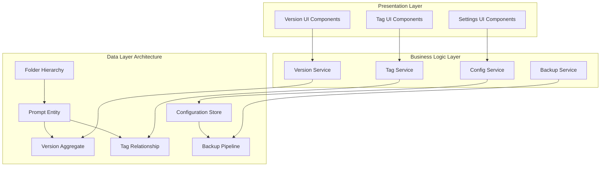
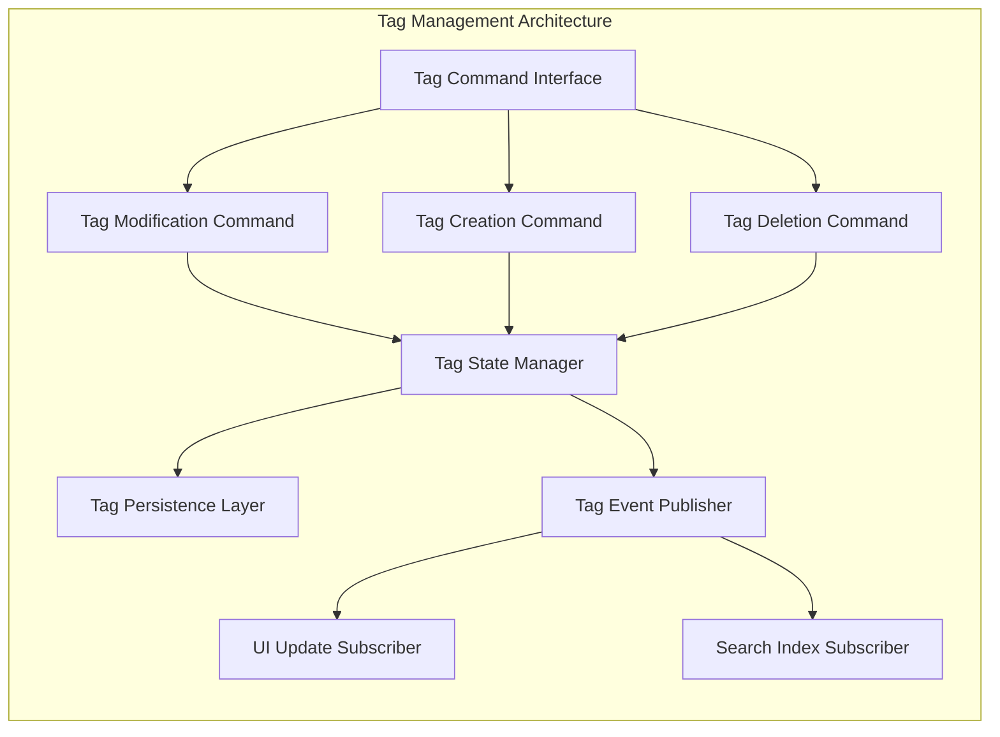
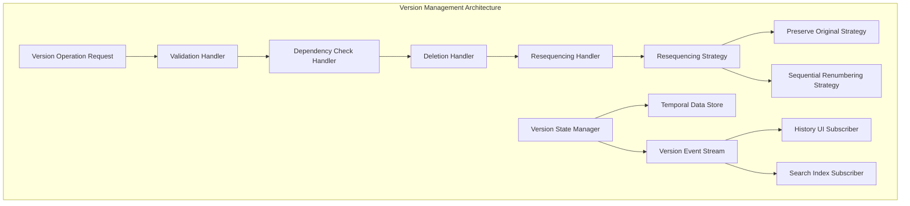
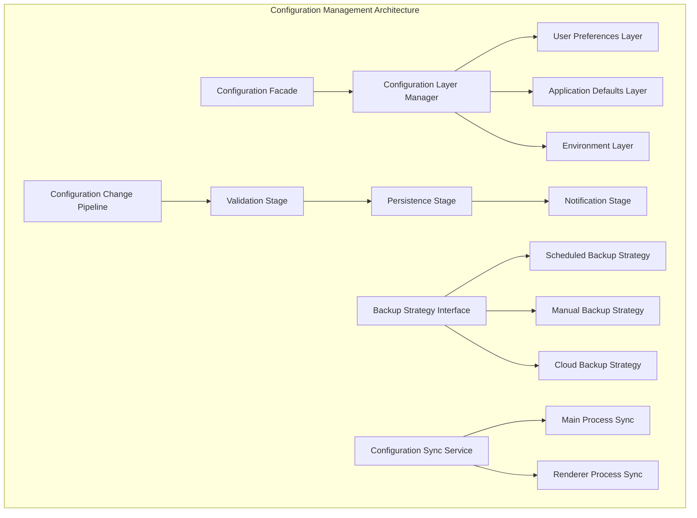
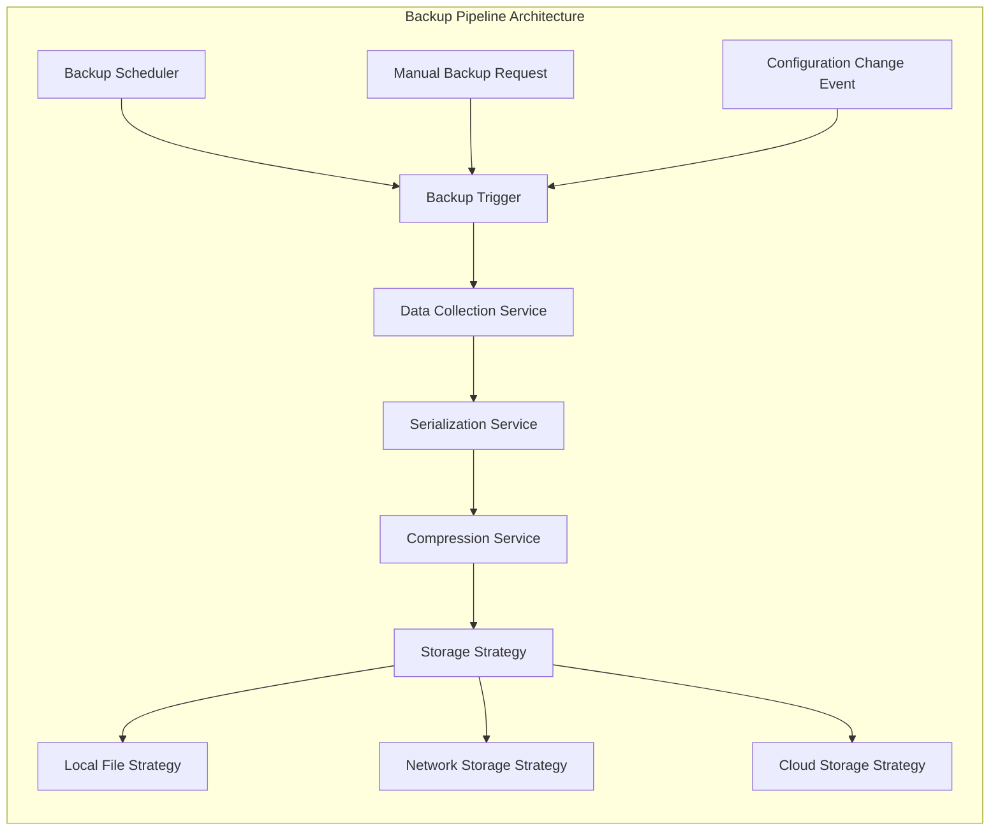
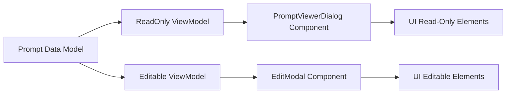
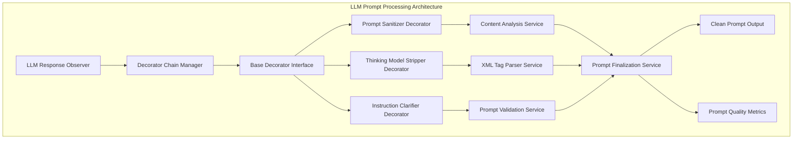
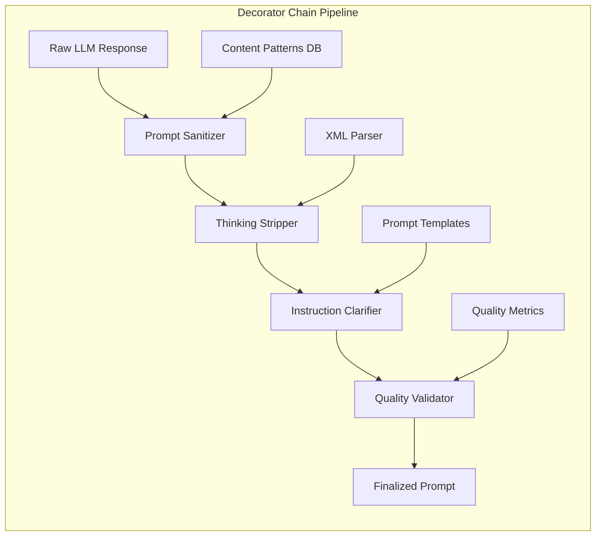
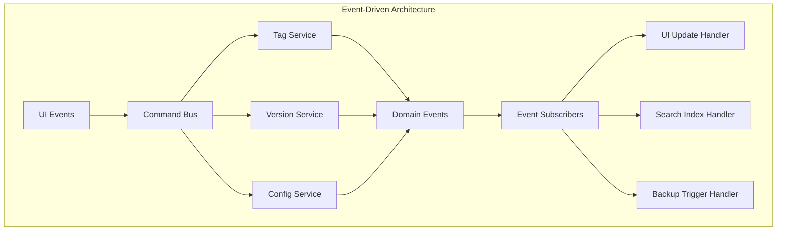
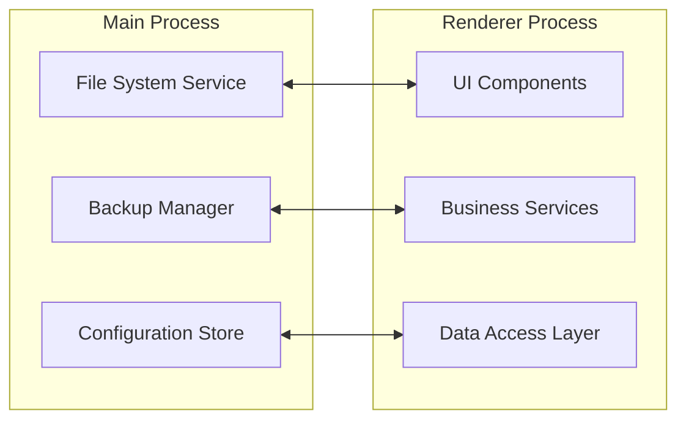

# AI Prompt Manager - System Architecture Blueprint

## Executive Summary

This document defines the architectural design patterns, system integration strategies, and component relationships for four critical improvements to the AI Prompt Manager Electron application. The focus is on architectural decisions, design patterns, and system boundaries rather than implementation details.

## System Architecture Overview

### Current Architecture Analysis

The AI Prompt Manager follows a **layered architecture pattern** with clear separation between:
- **Presentation Layer**: Electron renderer process with DOM manipulation
- **Business Logic Layer**: Tag management, version control, and configuration services
- **Data Access Layer**: IndexedDB abstraction through Dexie.js
- **Infrastructure Layer**: File system operations and IPC communication

### Architectural Principles

1. **Separation of Concerns**: Each improvement addresses a distinct architectural domain
2. **Event-Driven Design**: User interactions trigger cascading system events
3. **Data Immutability**: Version history maintains immutable state transitions
4. **Service Isolation**: Independent services for tags, versions, and configuration
5. **Cross-Process Communication**: IPC patterns for main/renderer coordination

### Data Architecture Patterns

---
## Improvement 1: Tag Modification Architecture

### Design Pattern: Command Pattern with State Isolation

**Architectural Challenge**: Current system couples tag modifications with version creation, violating single responsibility principle and creating unnecessary data proliferation.

**Design Solution**: Implement **Command Pattern** with **State Isolation** to separate tag operations from content versioning.

### Component Architecture

### Integration Strategy

**Service Boundaries**:
- **Tag Service**: Isolated tag operations without version coupling
- **Version Service**: Content-focused versioning independent of metadata
- **Event Bus**: Decoupled communication between services

**Data Flow Architecture**:
1. **Command Reception**: UI triggers tag modification command
2. **State Validation**: Tag service validates operation against current state
3. **Atomic Transaction**: Tag relationships updated in isolated transaction
4. **Event Propagation**: Tag change events broadcast to subscribers
5. **UI Synchronization**: Presentation layer updates reflect new tag state

### Architectural Decisions

**ADR-001: Tag-Only Modification Interface**
- **Context**: Users need metadata updates without content versioning
- **Decision**: Separate modal interface for tag-only operations
- **Consequences**: Reduced version proliferation, improved user experience
- **Trade-offs**: Additional UI complexity, separate code paths

**ADR-002: Command Pattern for Tag Operations**
- **Context**: Need reversible, auditable tag modifications
- **Decision**: Implement command pattern with undo capability
- **Consequences**: Better error handling, potential future undo feature
- **Trade-offs**: Increased architectural complexity

---
## Improvement 2: Version Management Architecture

### Design Pattern: Chain of Responsibility with Temporal Data Modeling

**Architectural Challenge**: Current version deletion lacks flexibility and creates gaps in version sequences, violating data integrity principles.

**Design Solution**: Implement **Chain of Responsibility** pattern with **Temporal Data Modeling** for flexible version lifecycle management.

### Component Architecture

### Integration Strategy

**Service Boundaries**:
- **Version Lifecycle Service**: Manages version creation, deletion, and transitions
- **Resequencing Service**: Handles version number management strategies
- **History Service**: Provides temporal queries and version navigation

**Data Flow Architecture**:
1. **Operation Request**: User initiates version deletion through history interface
2. **Validation Chain**: Series of handlers validate operation feasibility
3. **Dependency Resolution**: Check for references and constraints
4. **Atomic Deletion**: Version removed with referential integrity maintained
5. **Strategy Application**: Resequencing strategy applied based on user preference
6. **Event Notification**: Version change events propagated to subscribers

### Architectural Decisions

**ADR-003: Chain of Responsibility for Version Operations**
- **Context**: Complex validation and processing requirements for version operations
- **Decision**: Chain of responsibility pattern for extensible operation handling
- **Consequences**: Flexible validation pipeline, easy to extend with new rules
- **Trade-offs**: More complex debugging, potential performance overhead

**ADR-004: Strategy Pattern for Version Resequencing**
- **Context**: Users need different approaches to version numbering after deletion
- **Decision**: Strategy pattern with user-configurable resequencing behavior
- **Consequences**: Flexible version management, user control over numbering
- **Trade-offs**: Additional configuration complexity

---
## Improvement 3: Configuration Management Architecture

### Design Pattern: Layered Configuration with Plugin Architecture

**Architectural Challenge**: Current system lacks extensible configuration management, automated backup capabilities, and cross-process configuration synchronization.

**Design Solution**: Implement **Layered Configuration Architecture** with **Plugin Pattern** for extensible configuration sources and backup strategies.

### Component Architecture

### Integration Strategy

**Service Boundaries**:
- **Configuration Service**: Centralized configuration management with layered resolution
- **Backup Service**: Pluggable backup strategies with scheduling capabilities
- **Sync Service**: Cross-process configuration synchronization
- **Storage Abstraction**: Platform-agnostic file system operations

**Data Flow Architecture**:
1. **Configuration Request**: Component requests configuration value
2. **Layer Resolution**: Configuration resolved through layer hierarchy
3. **Change Detection**: Configuration changes trigger validation pipeline
4. **Cross-Process Sync**: Changes propagated to all application processes
5. **Backup Trigger**: Configuration changes trigger backup operations
6. **Persistence**: Changes persisted to appropriate storage layer

### Backup System Architecture

### Architectural Decisions

**ADR-005: Layered Configuration Architecture**
- **Context**: Need flexible configuration with multiple sources and precedence
- **Decision**: Layered configuration with hierarchical resolution
- **Consequences**: Flexible configuration management, clear precedence rules
- **Trade-offs**: Complexity in configuration resolution logic

**ADR-006: Plugin Architecture for Backup Strategies**
- **Context**: Different users need different backup approaches and destinations
- **Decision**: Strategy pattern with pluggable backup implementations
- **Consequences**: Extensible backup system, user choice in backup methods
- **Trade-offs**: Additional abstraction complexity

**ADR-007: Cross-Process Configuration Synchronization**
- **Context**: Electron's multi-process architecture requires configuration sync
- **Decision**: Event-driven synchronization with IPC communication
- **Consequences**: Consistent configuration across processes
- **Trade-offs**: IPC overhead, potential synchronization conflicts

---
## Improvement 4: Read-Only Prompt Viewer Dialog

### Design Pattern: Observer Pattern with UI Component Isolation

**Architectural Challenge**: Users require a way to view the details of their prompts without accidentally modifying them, while maintaining a clear separation of view/edit functionality in the UI.

**Design Solution**: Implement an **Observer Pattern** with strict **UI Component Isolation** to create a read-only interface for prompt viewing. This ensures complete separation from the edit workflows and maintains data immutability during viewing sessions.

### Component Architecture

### Integration Strategy

**Service Boundaries**:
- **Prompt Service**: Retrieves prompt data for viewing
- **UI Layer**: Separates read-only and edit components
- **IPC Handler**: Communicates data retrieval from main process

**Data Flow Architecture**:
1. **View Request**: User selects prompt for viewing
2. **Observer Registration**: ViewModal subscribes to selected prompt model
3. **Data Binding**: Prompt data bound to read-only ViewModel
4. **UI Rendering**: Dialog renders with UI elements in read-only state
5. **Unbind on Close**: Component detachment when dialog closes

### Architectural Decisions
**ADR-012: Component Isolation for Read-Only Views**
- Context: Prevents data modification through UI separation
- Decision: Separate Modal component with one-way data binding to ViewModel
- Consequences: Clear view/edit distinction, reduced security risk
- Trade-offs: Increased component complexity

**ADR-013: Event-Driven Update Mechanism**
- Context: Requires UI to refresh when prompt data changes from other sources
- Decision: Observer pattern with data subscription
- Consequences: Automatic update on external edits, maintains UI consistency
- Trade-offs: Requires testing for observer leaks
---
## Improvement 5: LLM Prompt Generation Enhancement

### Design Pattern: Observer Pattern with Decorator Chain Processing

**Architectural Challenge**: Current system prompts sent to LLMs lack clarity in directing the model to generate subsequent prompts rather than explanatory content. Additionally, thinking models that return chain-of-thought reasoning in `<think>...</think>` tags contaminate the final prompt output with internal reasoning processes.

**Design Solution**: Implement **Observer Pattern** with **Decorator Chain Processing** to monitor LLM responses and apply sequential transformations that sanitize explanatory content and strip thinking model artifacts.

### Component Architecture

### Integration Strategy

**Service Boundaries**:
- **LLM Response Service**: Monitors and captures LLM output for processing
- **Decorator Chain Service**: Manages sequential prompt transformation pipeline
- **Content Analysis Service**: Identifies and removes explanatory content patterns
- **XML Processing Service**: Handles thinking model tag detection and removal
- **Prompt Validation Service**: Ensures output meets prompt generation standards

**Data Flow Architecture**:
1. **Response Capture**: Observer monitors LLM response completion
2. **Chain Initialization**: Decorator chain manager prepares processing pipeline
3. **Content Sanitization**: Remove explanatory text and discussion elements
4. **Thinking Tag Removal**: Strip `<think>...</think>` sections from output
5. **Instruction Enhancement**: Ensure prompt clarity for subsequent LLM use
6. **Quality Validation**: Verify final prompt meets generation standards
7. **Output Finalization**: Deliver clean, focused prompt for LLM consumption

### Processing Pipeline Architecture

### Architectural Decisions

**ADR-014: Decorator Chain for Prompt Processing**
- **Context**: Need flexible, extensible processing stages for different LLM response types
- **Decision**: Implement decorator pattern with configurable processing chain
- **Consequences**: Modular processing pipeline, easy addition of new transformation stages
- **Trade-offs**: Increased complexity in chain management and error handling

**ADR-015: Thinking Model XML Tag Removal**
- **Context**: Thinking models contaminate prompt output with `<think>...</think>` reasoning chains
- **Decision**: Dedicated XML parsing stage to identify and strip thinking model artifacts
- **Consequences**: Clean prompt generation, compatibility with reasoning-capable models
- **Trade-offs**: Requires robust XML parsing to handle malformed or nested thinking tags

**ADR-016: Content Pattern Recognition for Prompt Sanitization**
- **Context**: LLMs often include explanatory text instead of direct prompt generation
- **Decision**: Pattern-based content analysis to identify and remove non-prompt content
- **Consequences**: Focused prompt output, reduced noise in generated prompts
- **Trade-offs**: Requires maintenance of content pattern database and false positive handling

**ADR-017: Observer-Based Response Monitoring**
- **Context**: Need real-time processing of LLM responses without blocking generation
- **Decision**: Observer pattern for non-intrusive response monitoring and processing
- **Consequences**: Seamless integration with existing LLM workflow, scalable processing
- **Trade-offs**: Additional complexity in observer lifecycle management

---
## System Integration Architecture

### Inter-Component Communication

### Cross-Process Architecture

### Data Consistency Patterns

**Eventual Consistency**: Tag modifications and UI updates follow eventual consistency model
**Strong Consistency**: Version operations require strong consistency for data integrity
**Configuration Consistency**: Cross-process configuration changes use synchronous consistency

---
## Technical Architecture Considerations

### Performance Architecture

- **Lazy Loading**: Tag trees and version history loaded on demand
- **Caching Strategy**: Frequently accessed configuration cached in memory
- **Batch Operations**: Multiple tag operations batched for performance
- **Index Optimization**: Search indices updated asynchronously

### Security Architecture

- **Input Validation**: All user inputs validated at service boundaries
- **File System Security**: Backup operations use secure file handling
- **Configuration Isolation**: Sensitive configuration isolated from user preferences
- **Cross-Process Security**: IPC communication uses secure channels

### Error Handling Architecture

- **Circuit Breaker**: Backup operations use circuit breaker pattern
- **Graceful Degradation**: System continues functioning with reduced features on errors
- **Error Boundaries**: UI errors contained within component boundaries
- **Recovery Strategies**: Automatic recovery for transient failures

---
## Migration and Deployment Architecture

### Database Migration Strategy

- **Schema Versioning**: Database schema changes managed through version migrations
- **Backward Compatibility**: New features maintain compatibility with existing data
- **Migration Rollback**: Failed migrations can be rolled back safely

### Feature Toggle Architecture

- **Configuration-Driven**: New features controlled through configuration flags
- **Gradual Rollout**: Features can be enabled incrementally
- **A/B Testing**: Different user groups can experience different feature sets

---
## Conclusion

This architectural blueprint provides the foundation for implementing four critical improvements to the AI Prompt Manager while maintaining system integrity, performance, and extensibility. The focus on design patterns, service isolation, and event-driven architecture ensures that each improvement can be developed and deployed independently while contributing to the overall system coherence.

The architectural decisions prioritize:
- **Maintainability** through clear separation of concerns
- **Extensibility** through plugin and strategy patterns
- **Reliability** through robust error handling and data consistency
- **Performance** through efficient data access and caching strategies
- **User Experience** through responsive, event-driven interfaces

Each improvement follows established architectural patterns while addressing specific user needs and system limitations, creating a cohesive evolution of the application's technical architecture.